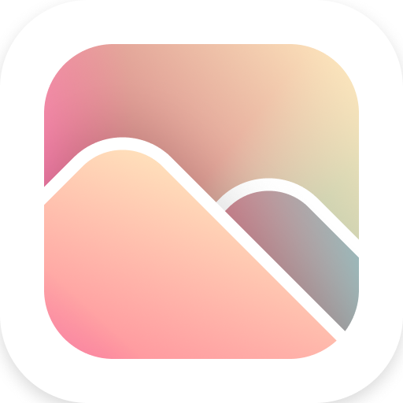
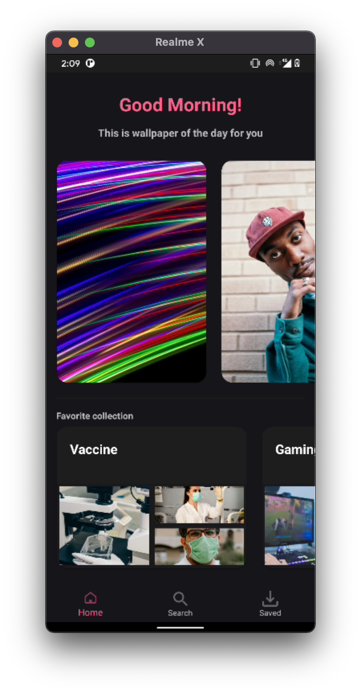
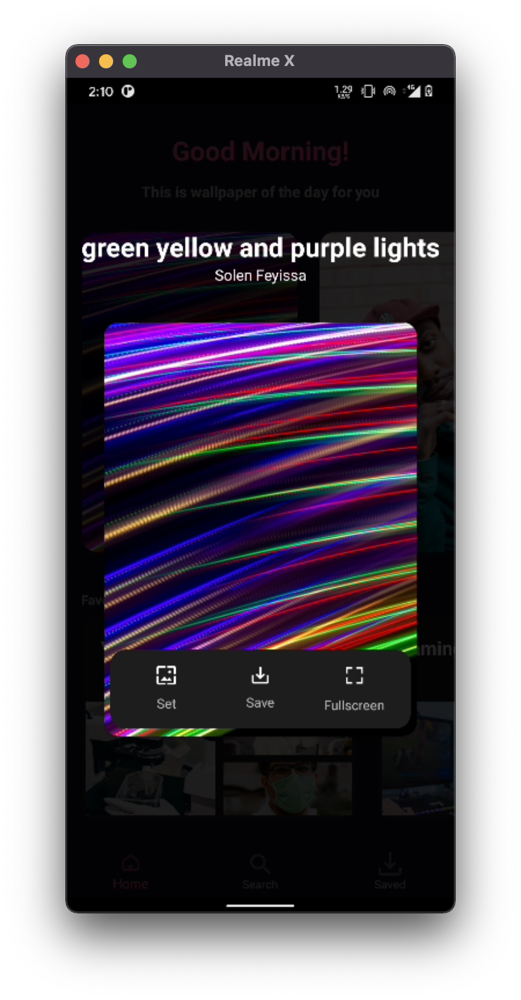
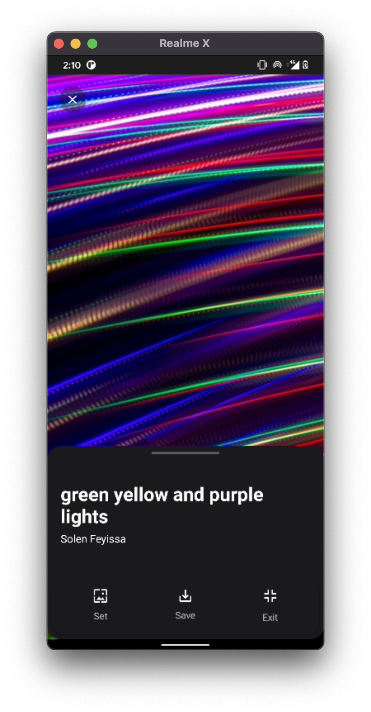
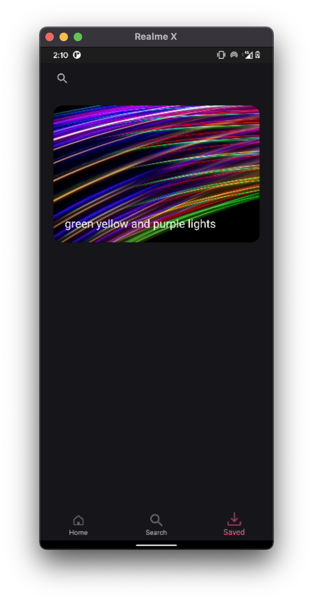
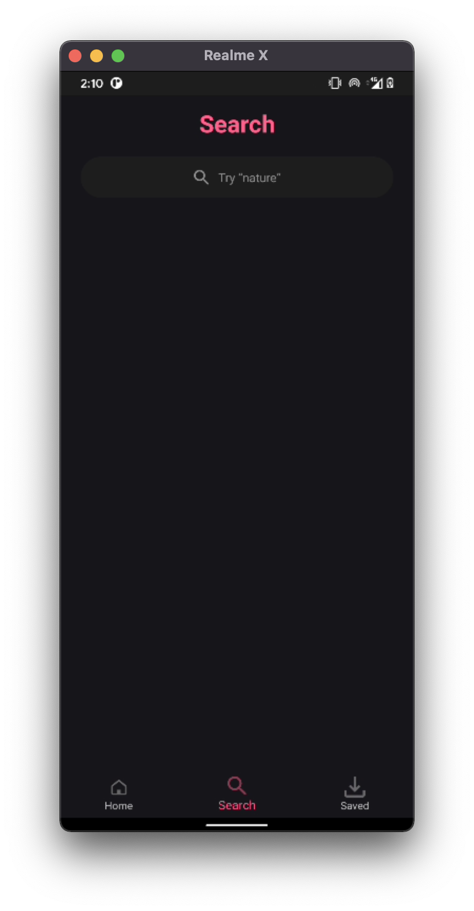
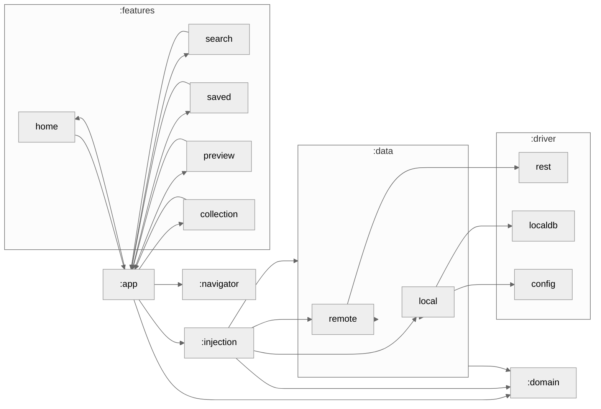

<!--
*** Thanks for checking out this README Template. If you have a suggestion that would
*** make this better, please fork the repo and create a pull request or simply open
*** an issue with the tag "enhancement".
*** Thanks again! Now go create something AMAZING! :D
-->

<!-- PROJECT SHIELDS -->
<!--
*** I'm using markdown "reference style" links for readability.
*** Reference links are enclosed in brackets [ ] instead of parentheses ( ).
*** See the bottom of this document for the declaration of the reference variables
*** for contributors-url, forks-url, etc. This is an optional, concise syntax you may use.
*** https://www.markdownguide.org/basic-syntax/#reference-style-links
-->

<!-- PROJECT LOGO -->
 

  
  <h3 align="center">Walla</h3>

  

    Open source wallpaper app for mobile phone.
  

  

    
  

    <table>
      <tr>
        <td></td>
        <td></td>
        <td></td>
      </tr>
      <tr>
        <td align="center">Home</td>
        <td align="center">Preview</td>
        <td align="center">Preview Large</td>
      </tr>
      <tr>
        <td></td>
        <td></td>
      </tr>
      <tr>
        <td align="center">Detail</td>
        <td align="center">Search</td>
      </tr>
    </table>

### Module Graph

## Built With
* [Kotlin](https://kotlinlang.org/)
* [Androidx](https://developer.android.com/jetpack/androidx)
* [View Binding](https://developer.android.com/topic/libraries/view-binding)
* [Glide](https://github.com/bumptech/glide)
* [Retrofit](https://github.com/square/retrofit)
* [OKHTTP](https://github.com/square/okhttp)
* [ViewModel](https://developer.android.com/topic/libraries/architecture/viewmodel)
* [LiveData](https://developer.android.com/topic/libraries/architecture/livedata)
* [Room](https://developer.android.com/jetpack/androidx/releases/room)
* [FCM](https://firebase.google.com/docs/cloud-messaging)

<!-- CONTRIBUTING -->
## Contributing

1. Fork the Project
2. Create your Feature Branch (`git checkout -b feature/AmazingFeature`)
3. Commit your Changes (`git commit -m 'Add some AmazingFeature'`)
4. Push to the Branch (`git push origin feature/AmazingFeature`)
5. Open a Pull Request

<!-- LICENSE -->
## License

Distributed under the MIT License. See `LICENSE` for more information.

<!-- CONTACT -->
## Contact

Anang Kurniawan - [@anang_kur](https://twitter.com/anang_kur) - anangk97@gmail.com

## Special Thanks
* Beautiful design by Setyono Dwi Utomo - [Twitter](https://twitter.com/setyonodwi) - [Instagram](https://instagram.com/setyonodwi)
* Image resources from [unsplash](https://unsplash.com/)

<!-- MARKDOWN LINKS & IMAGES -->
<!-- https://www.markdownguide.org/basic-syntax/#reference-style-links -->
[contributors-shield]: https://img.shields.io/github/contributors/othneildrew/Best-README-Template.svg?style=flat-square
[contributors-url]: https://github.com/othneildrew/Best-README-Template/graphs/contributors
[forks-shield]: https://img.shields.io/github/forks/othneildrew/Best-README-Template.svg?style=flat-square
[forks-url]: https://github.com/othneildrew/Best-README-Template/network/members
[stars-shield]: https://img.shields.io/github/stars/othneildrew/Best-README-Template.svg?style=flat-square
[stars-url]: https://github.com/othneildrew/Best-README-Template/stargazers
[issues-shield]: https://img.shields.io/github/issues/othneildrew/Best-README-Template.svg?style=flat-square
[issues-url]: https://github.com/othneildrew/Best-README-Template/issues
[license-shield]: https://img.shields.io/github/license/othneildrew/Best-README-Template.svg?style=flat-square
[license-url]: https://github.com/othneildrew/Best-README-Template/blob/master/LICENSE.txt
[linkedin-shield]: https://img.shields.io/badge/-LinkedIn-black.svg?style=flat-square&logo=linkedin&colorB=555
[linkedin-url]: https://linkedin.com/in/othneildrew