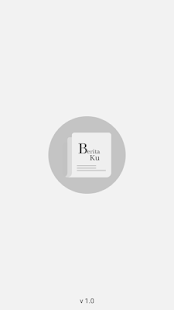
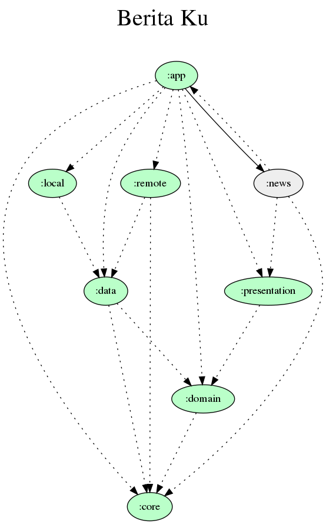

<!--
*** Thanks for checking out this README Template. If you have a suggestion that would
*** make this better, please fork the repo and create a pull request or simply open
*** an issue with the tag "enhancement".
*** Thanks again! Now go create something AMAZING! :D
-->

<!-- PROJECT SHIELDS -->
<!--
*** I'm using markdown "reference style" links for readability.
*** Reference links are enclosed in brackets [ ] instead of parentheses ( ).
*** See the bottom of this document for the declaration of the reference variables
*** for contributors-url, forks-url, etc. This is an optional, concise syntax you may use.
*** https://www.markdownguide.org/basic-syntax/#reference-style-links
-->

<!-- PROJECT LOGO -->
 

  

  <h3 align="center">Berita Ku Modular</h3>

  

    This is a sample project of implementing modular and clean architecture with MVVM pattern.
  

<!-- TABLE OF CONTENTS -->
## Table of Contents

* [About The Project](#about-the-project)
  * [Built With](#built-with)
* [Contributing](#contributing)
* [License](#license)
* [Contact](#contact)
* [Acknowledgements](#acknowledgements)

<!-- ABOUT THE PROJECT -->
## About The Project

<table>
  <tr>
    <td></td>
    <td></td>
    <td></td>
  </tr>
  <tr>
    <td align="center">Splash Screen</td>
    <td align="center">Home Screen</td>
    <td align="center">Detail News</td>
  </tr>
 </table>

Berita Ku is an experiment project for implementing modular structure of a project. At the first time Berita Ku has a monolitic structure as you can see in this [repo](https://github.com/anangkur/Berita-Ku).

This project is not only implementing modular structure, but also implement clean architecture following the concept that described in [android-clean-architecture-mvi-boilerplate](https://github.com/bufferapp/android-clean-architecture-mvi-boilerplate).

You can see the project depedency graph below.

 

## Built With
* [Kotlin](https://kotlinlang.org/)
* [Androidx](https://developer.android.com/jetpack/androidx)
* [Android Architecture Component](https://developer.android.com/topic/libraries/architecture/index.html)
* [Room](https://developer.android.com/topic/libraries/architecture/room.html)
* [View Binding](https://developer.android.com/topic/libraries/view-binding)
* [Navigation Component](https://developer.android.com/guide/navigation/navigation-getting-started)
* [Material Design](https://material.io/design/)
* [Kotlin Coroutines](https://kotlinlang.org/docs/reference/coroutines-overview.html)
* [Glide](https://github.com/bumptech/glide)
* [Retrofit](https://square.github.io/retrofit/)
* [Okhttp](https://square.github.io/okhttp/)
* [Gson](https://github.com/google/gson)
* [Chuck](https://github.com/jgilfelt/chuck)

<!-- CONTRIBUTING -->
## Contributing

1. Fork the Project
2. Create your Feature Branch (`git checkout -b feature/AmazingFeature`)
3. Commit your Changes (`git commit -m 'Add some AmazingFeature'`)
4. Push to the Branch (`git push origin feature/AmazingFeature`)
5. Open a Pull Request

<!-- LICENSE -->
## License

Distributed under the MIT License. See `LICENSE` for more information.

<!-- CONTACT -->
## Contact

Anang Kurniawan - [@anang_kur](https://twitter.com/anang_kur) - anang@sampingan.co.id

<!-- ACKNOWLEDGEMENTS -->
## Acknowledgements
* [Plaid](https://github.com/android/plaid)
* [Patchwork Plaid - A modularization story](https://medium.com/androiddevelopers/a-patchwork-plaid-monolith-to-modularized-app-60235d9f212e)
* [BufferApp](https://github.com/bufferapp/android-clean-architecture-mvi-boilerplate)
* [Modularization Example by Jeroen Mols](https://github.com/JeroenMols/ModularizationExample)
* [Moularzaton by Jeroen Mols](https://jeroenmols.com/blog/2019/03/06/modularizationwhy/)

<!-- MARKDOWN LINKS & IMAGES -->
<!-- https://www.markdownguide.org/basic-syntax/#reference-style-links -->
[contributors-shield]: https://img.shields.io/github/contributors/othneildrew/Best-README-Template.svg?style=flat-square
[contributors-url]: https://github.com/othneildrew/Best-README-Template/graphs/contributors
[forks-shield]: https://img.shields.io/github/forks/othneildrew/Best-README-Template.svg?style=flat-square
[forks-url]: https://github.com/othneildrew/Best-README-Template/network/members
[stars-shield]: https://img.shields.io/github/stars/othneildrew/Best-README-Template.svg?style=flat-square
[stars-url]: https://github.com/othneildrew/Best-README-Template/stargazers
[issues-shield]: https://img.shields.io/github/issues/othneildrew/Best-README-Template.svg?style=flat-square
[issues-url]: https://github.com/othneildrew/Best-README-Template/issues
[license-shield]: https://img.shields.io/github/license/othneildrew/Best-README-Template.svg?style=flat-square
[license-url]: https://github.com/othneildrew/Best-README-Template/blob/master/LICENSE.txt
[linkedin-shield]: https://img.shields.io/badge/-LinkedIn-black.svg?style=flat-square&logo=linkedin&colorB=555
[linkedin-url]: https://linkedin.com/in/othneildrew
